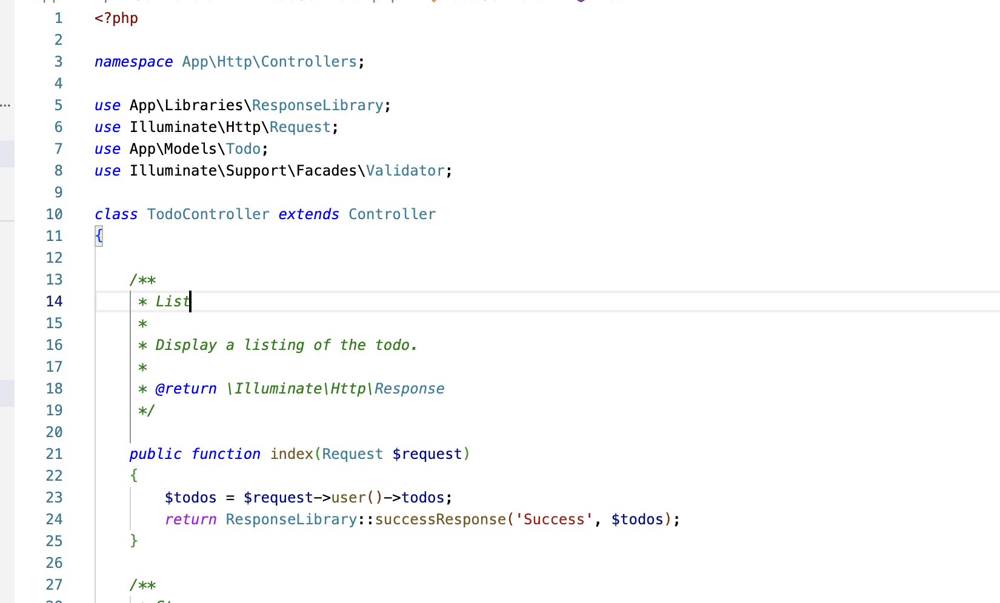

## Hi everyone, I'm Miftahul Ulum 👋

-   👋 Hi, I’m @miftahululum002
-   👀 I’m interested in <b>Information Technology</b>
-   🌱 I’m currently learning <b>Coding Educator</b>
-   💞️ I’m looking to collaborate on <b>Software Development</b>

## GitHub Status

  
   
  

<h3>GitHub Trophies:</h3>

  

## Tech Stack And Tools:

  	
 
  		
  		
  		
  		
    	 
		 
		 
		 
		 
		 
    	 
    	 
    	 
    	 
    	 
		 
		 
		 
		 
		 
		 
		 
		 
		 
		 
		 
		 
		 
		 
		 
		 
		 
		 
		 
		 
		 
		 
		 
		 
		 
		 
		 
		 
		 
		 
		 
		 
		 
		 
		 
		 
		 
		 
		 
		 
		 
		 
		 
		 
		 
		 
		 
		 
		 
		 
		 
		 
		 
		 
		 
		 
		 
		 
		 
		 
		 
		 
		 
		 
		 
		 
		 
		 
		 
		 
		 
		 
		 
		 
		 
		 
		 
		 
		 
		 
		 
		 
		 
		 
		 
		 
		 
		 
		 
		 
		 
		 
		 
    

## 📫 How to reach me ...

  - <b>Instagram : <a href="https://instagram.com/miftahululum002">@miftahululum002</a></b> 
  - <b>Linkedin : <a href="https://www.linkedin.com/in/miftahululum002/">Miftahul Ulum</a></b> 
  - <b>Email : <a href="mailto:ulumiftahul06@gmail.com">ulumiftahul06@gmail.com</a></b>

 

 <i> Happy exploring my friend! </i> 😄 

<!---
miftahululum002/miftahululum002 is a ✨ special ✨ repository because its `README.md` (this file) appears on your GitHub profile.
You can click the Preview link to take a look at your changes.
--->
